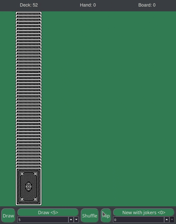
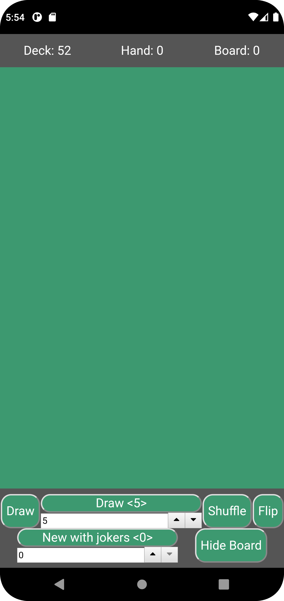

# Draw Cards
A simple card drawing web app created with React hosted in github pages.

interactive demo [https://soglahash.github.io/cards/](https://soglahash.github.io/cards/)



## Features

* Create a deck of 52 with optional (up to 12) jokers cards
* French-suited SVG rendered cards
* Continue drawing from the same deck
* Draw one or multiple cards at once
* Mouseover to draw a card from anywhere in the deck
* Shuffle the deck
* Flip over the deck
* Status bar to show number of cards in deck, hand and previously drawn
* Neatly show cards drawn and cards from previous draws


## Credit to NPM Modules
* svg-cards [https://github.com/htdebeer/SVG-cards](https://github.com/htdebeer/SVG-cards)
* react-widgets/NumberPicker [https://jquense.github.io/react-widgets/docs/NumberPicker/](https://jquense.github.io/react-widgets/docs/NumberPicker/)

## Getting Started with Create React App

This project was bootstrapped with [Create React App](https://github.com/facebook/create-react-app).

## Learn More

You can learn more in the [Create React App documentation](https://facebook.github.io/create-react-app/docs/getting-started).

To learn React, check out the [React documentation](https://reactjs.org/).

# Build Mobile Android // iOS
Options
1. create react-native app. Requires rewriting code 👎
1. convert react to react-native. No need to rewrite any code 👍

## convert react to react-native with [Cordova](https://cordova.apache.org/#getstarted)
from: https://stackoverflow.com/questions/35463547/what-is-the-quickest-way-to-convert-a-react-app-to-react-native
TLDR;
```
create Cordova app, add android platform and build. open project with android studio and simulate with virtual device.
```

Copy-pasted steps^
>1. Open your Cordova MyApp www folder, delete all files and folders in it except for the 'js' folder
>2. Back in your react build folder update the index file to add two cordova scripts:
```
<script type="text/javascript" src="cordova.js"></script>
<script type="text/javascript" src="js/index.js"></script>
```
>3. copy all your files from the react build folder into the Cordova www folder (replacing everything except the js folder)

Build will fail without installing android studio, gradle, java
```
cordova build android
```


`apt install gradle`
`.bashrc`
```
# ANDROID_HOME
export ANDROID_HOME="/home/jelle/Android/Sdk"
# JAVA_HOME
export JAVA_HOME=/usr/lib/jvm/java-11-openjdk-amd64
export PATH=$PATH:$JAVA_HOME/bin
```

### Bug1: Blank page when building as is.
Change `"homepage": ".",` in `package.json`
### Bug2: Cards no longer show up as svg-cards.svg is no longer accessible
Running `index.html` through web
```
Security Error: Content at file:///home/usr/wd/MyApp/www/index.html may not load data from file:///home/usr/wd/MyApp/www/static/media/svg-cards.218fd87b282c15dbca488d705ba056bd.svg.
```
Cordova
```
2022-07-13 17:40:42.934 5168-5223/io.cordova.hellocordova E/va.hellocordov: Failed to open file '/data/data/io.cordova.hellocordova/code_cache/.overlay/base.apk/assets/www/static/media/svg-cards.218fd87b282c15dbca488d705ba056bd.svg': No such file or directory
```



